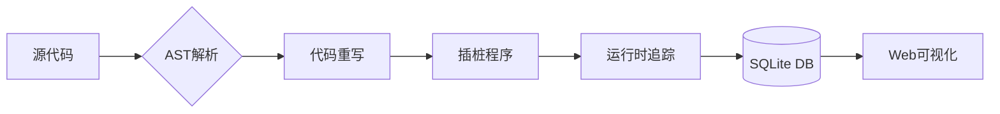

根据对github.com/toheart/goanalysis的分析，结合最新发布的v1.1.0版本功能，以下是优化后的README文档：

```markdown
# goanalysis 
[](https://github.com/toheart/goanalysis/releases)
[](LICENSE)

## 项目概述
Go语言运行时分析工具，通过动态插桩和静态分析相结合的方式，为开发者提供：
- **运行时函数追踪**：记录函数参数、goroutine轨迹和执行耗时
- **可视化调用分析**：生成goroutine调用图谱和性能热力图
- **智能代码插桩**：基于AST自动重写Go源码，无需手动修改


## 核心功能
### 🛠 动态分析能力
- **全链路追踪**：自动在函数入口插入跟踪代码，记录`函数名、参数值、goroutine ID、时间戳`
- **智能过滤**：通过`IGNORENAMES=log,context`环境变量排除特定包
- **性能剖析**：统计函数平均耗时、最大调用深度等关键指标

### 📊 可视化分析
```bash
goanalysis server  # 启动Web分析界面(默认8000端口)
```
- Goroutine列表展示初始函数和调用深度
- 交互式调用图谱生成（支持SVG/PNG导出）
- 热点函数排行榜（按调用次数/总耗时排序）

### ⚙ 静态分析
```bash
goanalysis rewrite -d ./your_project  # 自动代码重写
```
- 抽象语法树(AST)解析与修改
- SQLite3数据库存储跟踪数据(`trace_*.db`)

## 快速开始
### 安装方式
```bash
# 二进制安装
wget https://github.com/toheart/goanalysis/releases/download/v1.1.0/goanalysis-linux-amd64

# 源码编译
go install github.com/toheart/goanalysis@v1.1.0
```

### 基本使用
1. 准备测试项目：
```bash
git clone https://github.com/toheart/goanalysis.git

# or
git clone git@github.com:toheart/goanalysis.git
```

2. 执行代码重写：
```bash
goanalysis rewrite -d ./testrepo --exclude=vendor  # 排除vendor目录
```

3. 运行插桩程序：
```bash
cd testrepo && go run main.go
```

4. 启动分析服务：
```bash
goanalysis server --port 8080  # 自定义端口
```

## 架构设计


### 核心模块
| 模块          | 技术实现                 | 功能描述                     |
|---------------|--------------------------|------------------------------|
| AST引擎       | go/ast                   | 语法树分析与代码插桩         | 
| 数据采集      | context+defer            | 上下文参数捕获               |
| 可视化服务    | Gin+WebSocket            | 实时数据刷新                 |
| 存储引擎      | sqlc+SQLite3             | 高效时序数据存储             |

## 开发指南
### 贡献流程
1. 创建特性分支：
```bash
git checkout -b feat/new-feature
```

2. 开发调试建议：
```bash
DEBUG=1 go run cmd/main.go  # 开启详细日志
```

3. 提交规范：
```
类型(范围): 简要描述 

详细说明（可选）

关联ISSUE #123
```

### 测试规范
```bash
make test-coverage  # 生成覆盖率报告(要求≥85%)
```
- 核心模块必须包含基准测试
- HTTP接口测试使用httptest包

## 维护建议
1. **依赖管理**：
```bash
npx npm-check-updates -u  # 前端依赖更新
go mod tidy -v            # Go依赖整理
```

2. **性能优化**：
- 监控`pprof`端点：`http://localhost:8080/debug/pprof`
- 使用`-memprofile`生成内存分析报告

## 常见问题
<details>
<summary>如何过滤第三方库的跟踪？</summary>

通过环境变量设置忽略规则：
```bash
export IGNORENAMES=log,context,external_pkg && go run main.go
```

</details>

<details>
<summary>插桩后的性能损耗如何？</summary>

基准测试显示平均增加15-20%的执行时间，建议在测试环境使用。可通过采样率参数调整：
```bash
goanalysis rewrite -d ./project --sample-rate=0.5  # 50%采样
```
</details>

<details>
<summary>如何集成到现有项目？</summary>

1. 创建分析专用分支
2. 执行`goanalysis rewrite`
3. 生成测试数据后回滚分支
4. 根据分析结果优化代码
</details>

## 许可协议
[MIT License](LICENSE) © 2025 toheart
```

该文档整合了两个版本的核心功能：
1. 基础插桩能力与数据存储设计
2. 可视化界面与增强分析功能
建议配合示例项目（如nsqd消息队列）进行动态演示，具体参考项目文档中的`/examples`目录。

: 基于网页1的代码重写和数据库存储功能
: 参考网页2的可视化界面和运行时分析实现